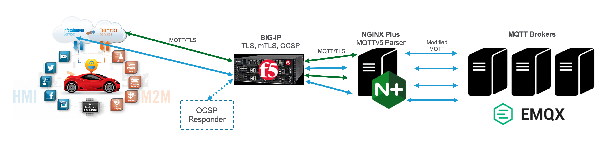

# MQTT5
**MQTTv5 Parser for NGINX JavaScript (njs)**

NOTE: *You must have an existing NGINX Plus Docker image tagged as `nginxplus` with the njs module installed. [Learn how to make one here.](https://www.nginx.com/blog/deploying-nginx-nginx-plus-docker/#Deploying-NGINX-Plus-with-Docker)*

*What does this do?*
---
1. Accept incoming TCP connection, decrypt TLS and perform mTLS client authentication
2. Parse Client Certificate and retrieve Subject DN
3. Parse MQTT CONNECT message (All fields are made available for logging or further processing)
4. Compare last 9 characters of Client ID in MQTT message to Subject DN in Client Certificate
5. Reject connection if they don’t match
6. Construct new MQTT CONNECT message with embedded Subject DN in “username” field
7. Proxy TCP connection with modified CONNECT message to EMQ X MQTT Brokers

*Using with Docker Compose*
---

Use `docker-compose up` to start NGINX and the EMQX MQTT Broker

Self signed TLS and mTLS certificates are automatically generated in the *mtls* folder.  The `mosquitto` MQTT clients are also installed in the nginx "proxy" container.  Use `docker exec` to get a shell inside the `mqtt5-proxy-1` container, `cd` into the `/mtls` folder and you will find two shell scripts to make test MQTT connections.  The `test.sh` script makes a mTLS connection while the `test1883.sh` script connects to port 1883 without encryption.  On your host, the mTLS certificates are available in the *mtls* folder for using native MQTT clients like [MQTT X](https://mqttx.app/).

The following ports will be mapped to localhost on your Docker host:

* 1883: MQTT in the clear
* 8883: MQTT over TLS
* 18083: EMQX Dashboard (admin/admin)

Use `tail -f` inside the `mqtt5-proxy-1` container to monitor the `mqtt_access.log` and `mqtt_error.log` files in `/var/log/nginx` and see how incoming MQTT connections are processed.

*Using with Visual Studio Code*
---

After cloning this repo in VS Code, you will be asked to open the folder in a devContainer.  This devContainer is the same as the `mqtt5-proxy-1` container described above.  When the devContainer opens, the EMQx broker is also started automatically via `docker-compose.`

Typescript declaration files for njs are installed in your workspace to enable Intellisense and autocompletions. Hover over methods in `proxy.js` to see usage info.

A terminal session will automatically open inside the devContainer so you can monitor logs, run test scripts, and control NGINX as described above.

To leave the devContainer, select "Reopen folder locally" in the VS Code command palette.  You will need to right click on the `docker-compose.yml` file and select "Compose Down" to shutdown containers.

*Customizing the Code*
---

Files in the workspace can be edited locally or in the container.  Just run `nginx -s reload` in the `mqtt5-proxy-1` container terminal after saving a change. In Visual Studio Code, you can trigger a reload in the devContainer by selecting **Run Build Task** (⇧⌘B)

There are two exported modules in the `proxy.js` file: `prereadMQTT()` and `filterMQTT()`

The `prereadMQTT()` module is used with `js_preread` in *nginx.conf* to parse the CONNECT message and extract useful fields for further processing or logging.  Use `js_var` to make variables available in *nginx.conf.*  See `clientID` and `username` for examples. The `test1883.sh` script tests this module.

The `filterMQTT()` module is used with `js_filter.`  After the CONNECT message is parsed, a new CONNECT message is constructed that you can modify before it is sent to the upstream MQTT broker.  Just modify the variables you want to change as shown in the code.  The `test.sh` script tests this module.

The `filterMQTT()` module also contains code to compare the MQTT Client ID to the mTLS Client Certificate Subject DN and reject connections where they don't match.

*Notes*
---

NGINX does not support OCSP stapling for the `stream{}` context so we use BIG-IP's *Client Certificate Constrained Delegation* (C3D) feature to handle that for us as shown in the diagram above.

The dashboard for EMQ X is available at http://localhost:18083
The dashboard for NGINX Plus is available at http://localhost/dashboard.html

Session persistence based on MQTT Client ID is enabled.

MQTTv5 active health checks are used to determine broker availability.

Take a look at the `.devcontainer` and `.vscode` folders to see how the Visual Studio Code was done.

Please open a GitHub issue if you have questions or find a bug.

Thanks in advance for your feedback!
